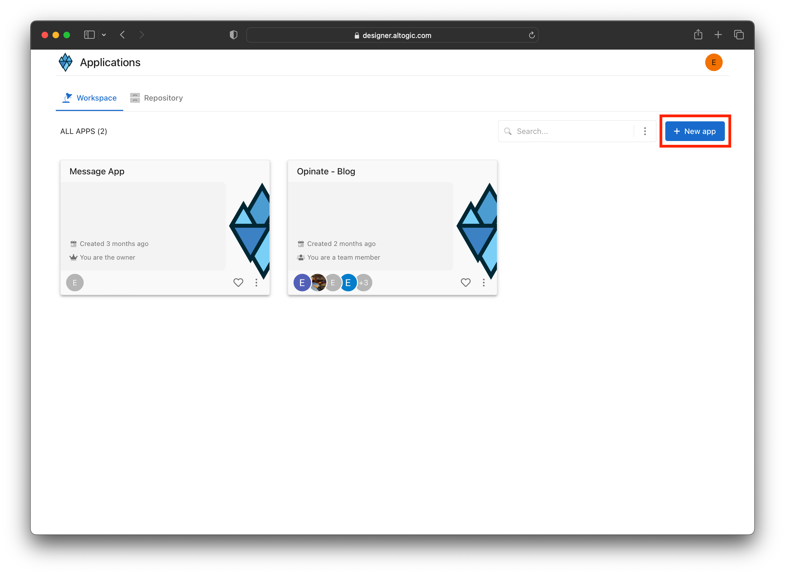

# How to Authenticate Email and Password Using React & Altogic

## Introduction
**Altogic** is a Backend as a Service (BaaS) platform and provides a variety of services in modern web and mobile development. Most of the modern applications using React or other libraries/frameworks require to know the identity of a user. And this necessity allows an app to securely save user data and session in the cloud and provide more personalized functionalities and views to users.

Altogic has an Authentication service that integrates and implements well in JAMstack apps. It has a ready-to-use Javascript client library, and it supports many authentication providers such as email/password, phone number, magic link, and OAuth providers like Google, Facebook, Twitter, Github, etc.,

In this tutorial, we will implement email/password authentication with React and take a look how as a React developer we build applications and integrate with Altogic Authentication.

After completion of this tutorial, you will learn:

* How to create sample screens to display forms like login and signup.
* How to create a home screen and authorize only logged-in users.
* How to create different routes using the react-router-dom.
* How to create an authentication flow by conditionally rendering between these pages whether a user is logged-in or not.
* How to authenticate users using magic link
* How to update user profile info and upload a profile picture
* And we will integrate Altogic authentication with the email/password method.

If you are new to React applications, this tutorial is definitely for you to understand the basics and even advanced concepts.


## Prerequisites
* Altogic account (if you have not one yet, you can create an account by sign-in up to **Altogic**)
* Familiarity with the command line
* Any text editor or IDE (WebStorm, VsCode, Sublime, Atom, etc.)
* Basic knowledge of Javascript
* Basic knowledge of React

## Creating an Altogic App
We will use Altogic as a backend service platform, so let’s visit [Altogic Designer](https://designer.altogic.com/) and create an account.


After creating an account, you will see the workspace where you can access your apps.

Click + New app and follow the instructions;

1. In the App name field, enter a name for the app.
2. Enter your subdomain.
3. Choose the deployment location.
4. And select your free execution environment pricing plan.


Then click Next and select Basic Authentication template. This template is creates a default user model for your app which is required by [Altogic Client Library](https://github.com/altogic/altogic-js) to store user data and manage authentication.

Then click Next and select Basic Authentication template. This template is based on session authentication and highly recommended to secure your apps.


Then click Next to confirm and create an app.

Awesome! We have created our application; now click/tap on the **newly created app to launch the Designer.**

> This is the only configuration we need to do in Altogic Designer. In order to access the app and use the Altogic client library, we should get envUrl and clientKey of this app.
Click the **Home** icon at the left sidebar to copy the envUrl and clientKey.


Once the user created successfully, our React app will route the user to the Verification page, and a verification email will be sent to the user’s email address. When the user clicks the link in the mail, the user will navigate to the redirect page to grant authentication rights. After successfully creating a session on the Redirect page, users will be redirected to the Home page.

## Quick Tip
> If you want, you can deactivate or customize the mail verification from **App Settings -> Authentication** in Logic Designer.

## Create a React project
```bash
npx create-react-app
```

## Integrating with Altogic
Our backend and frontend is now ready and running on the server. ✨

Now, we can install the Altogic client library to our React app to connect our frontend with the backend.

```sh
# using npm
npm install altogic
# OR is using yarn
yarn add altogic
```

Let’s create a configs/ folder inside of the src/ directory to add altogic.js file.

Open altogic.js and paste below code block to export the altogic client instance.

/src/configs/altogic.js

```javascript
import { createClient } from "altogic";

// This `envUrl` and `clientKey` is sample you need to create your own.
let envUrl = 'https://auth.c1-na.altogic.com';
let clientKey = 'e574fee1fb2b443...a8598ca68b7d8';

const altogic = createClient(envUrl, clientKey);

export default altogic;
```

> Replace envUrl and clientKey which is shown in the <strong>Home</strong> view of [Altogic Designer](https://designer.altogic.com/).

## Create an Authentication Context
We need to share data across our components. We can use this hook throughout our application by creating an authentication context. Passing down the authentication status to each component is redundant. It leads to prop drilling, so using context is a good option. If you are not familiar with Context API in React, check out their docs [here](https://reactjs.org/docs/context.html).

> The React Context API is a state management tool used for sharing data across React components.

Let’s create contexts/ folder inside of the src/ directory to add Auth.context.js file inside it.

Open Auth.context.js and copy following code.
```javascript
import React, { useState, useEffect, useContext } from "react";
import altogic from "../configs/altogic";

const Context = React.createContext(null);

const useFetchAuth = () => {
  const [fetchedAuth, setFetchedAuth] = useState(undefined);
  const [fetchedSession, setFetchedSession] = useState(undefined);

  useEffect(() => {
    // Check if user information is exist in db
    altogic.auth
      .getUserFromDB()
      .then(({ user }) => {
        setFetchedAuth(user);
      })
      .catch(() => setFetchedAuth(null));

    // Check if session information is exist in storage
    const sessionFromStorage = altogic.auth.getSession();
    setFetchedSession(sessionFromStorage || null);
  }, []);

  return { fetchedAuth, fetchedSession };
};

const Provider = ({ children }) => {
  const { fetchedAuth, fetchedSession } = useFetchAuth();

  const [auth, setAuth] = useState(fetchedAuth);
  const [session, setSession] = useState(fetchedSession);

  useEffect(() => {
    // Set user information to auth state if it's exist in storage
    setAuth(fetchedAuth);
  }, [fetchedAuth]);
  useEffect(() => {
    // Set user information to storage when auth state's changed
    altogic.auth.setUser(auth);
  }, [auth]);

  useEffect(() => {
    // Set session information to auth state if it's exist in storage
    setSession(fetchedSession);
  }, [fetchedSession]);
  useEffect(() => {
    // Set session information to storage when auth state's changed
    altogic.auth.setSession(session);
  }, [session]);

  return (
    <Context.Provider
      value={{
        auth,
        setAuth,
        session,
        setSession,
      }}
    >
      {children}
    </Context.Provider>
  );
};

export const useAuthContext = () => {
  const context = useContext(Context);
  return context;
};

export default Provider;
```

## Create Routes

### Private Route Component
To secure the application and authorize users to access specified routes let’s create PrivateRoute.js inside the components directory and paste the code below.

```javascript
import { useEffect } from "react";
import { useNavigate } from "react-router-dom";
import { useAuthContext } from "../contexts/Auth.context";

function PrivateRoute({ children }) {
  const { auth } = useAuthContext();
  const navigate = useNavigate();

  useEffect(() => {
    if (auth === null) {
      // Navigate to sign in, if the user has not session
      navigate("/sign-in");
    }
  }, [auth]);

  return (
    <div>
      {auth === undefined ? (
        <div>Loading...</div>
      ) : auth ? (
        children
      ) : (
        <div>You are redirecting to the login...</div>
      )}
    </div>
  );
}

export default PrivateRoute;
```

> Previously we have created our authentication context to use user information. And, here, we are controlling session to route users, whether the Login page or the children.

Now we can wrap necessary routes with the PrivateRoute component to specify access in the App.js. Let’s open it and wrap our Profile page with the PrivateRoute as the screen below.

Here also you can copy the code;

```js
import { BrowserRouter as Router, Route, Routes } from "react-router-dom";
import PrivateRoute from "./components/PrivateRoute";

import AuthProvider from "./contexts/Auth.context";
import AuthRedirectView from "./pages/auth-redirect";
import IndexView from "./pages/index";
import MagicLinkView from "./pages/magic-link";
import ProfileView from "./pages/profile";
import SignInView from "./pages/sign-in";
import SignUpView from "./pages/sign-up";

export default function App() {
  return (
    <AuthProvider>
      <Router>
        <Routes>
          {/* Public Routes */}
          <Route path="/" element={<IndexView />} />
          <Route path="/auth-redirect" element={<AuthRedirectView />} />
          <Route path="/magic-link" element={<MagicLinkView />} />
          <Route path="/sign-in" element={<SignInView />} />
          <Route path="/sign-up" element={<SignUpView />} />
          {/* Private Routes */}
          <Route
            path="/profile"
            element={
              <PrivateRoute>
                <ProfileView />
              </PrivateRoute>
            }
          />
        </Routes>
      </Router>
    </AuthProvider>
  );
}
```

Let's create some views in **src/pages/** folder as below:
* index.js
* sign-in.js
* sign-up.js
* auth-redirect.js
* magic-link.js
* profile.js

### Replacing pages/index.js with the following code:
```javascript
import { Link } from "react-router-dom";

function IndexView() {
  return (
    <div className="flex items-center justify-center gap-4 h-screen">
      <Link className="border px-4 py-2 font-medium text-xl" to="/magic-link">
        Login With Magic Link
      </Link>
      <Link className="border px-4 py-2 font-medium text-xl" to="/sign-in">
        Sign In
      </Link>
      <Link className="border px-4 py-2 font-medium text-xl" to="/sign-up">
        Sign Up
      </Link>
    </div>
  );
}
export default IndexView;
```

### Replacing pages/sign-in.js with the following code:
```javascript
import { useState } from "react";
import { Link, useNavigate } from "react-router-dom";
import altogic from "../configs/altogic";
import { useAuthContext } from "../contexts/Auth.context";

function SignInView() {
  const { setAuth, setSession } = useAuthContext();
  const navigate = useNavigate();

  const [inpEmail, setInpEmail] = useState("");
  const [inpPassword, setInpPassword] = useState("");

  const [error, setError] = useState(null);
  const [loading, setLoading] = useState(false);

  const handleSignIn = async () => {
    try {
      setLoading(true);
      const { user, session, errors } = await altogic.auth.signInWithEmail(
        inpEmail,
        inpPassword
      );

      if (errors) {
        throw errors;
      }

      setAuth(user);
      setSession(session);
      navigate("/profile");
    } catch (err) {
      setLoading(false);
      setError(err.items);
    }
  };

  return (
    <section className="flex flex-col items-center justify-center h-96 gap-4">
      <div className="flex flex-col gap-2 w-full md:w-96">
        <h1 className="self-start text-3xl font-bold">Login to your account</h1>
        {error?.map(({ message }) => (
          <div key={message} className="bg-red-600 text-white text-[13px] p-2">
            <p>{message}</p>
          </div>
        ))}

        <input
          type="email"
          placeholder="Type your email"
          onChange={(e) => setInpEmail(e.target.value)}
          value={inpEmail}
        />
        <input
          autoComplete="new-password"
          type="password"
          placeholder="Type your password"
          onChange={(e) => setInpPassword(e.target.value)}
          value={inpPassword}
        />
        <div className="flex justify-between gap-4">
          <Link className="text-indigo-600" to="/sign-up">
            Don't have an account? Register now
          </Link>
          <button
            type="submit"
            className="border py-2 px-3 border-gray-500 hover:bg-gray-500 hover:text-white transition shrink-0"
            disabled={loading}
            onClick={handleSignIn}
          >
            Login
          </button>
        </div>
      </div>
    </section>
  );
}

export default SignInView;
```

### Replacing pages/magic-link.js with the following code:
```javascript
import { useState } from "react";
import { Link } from "react-router-dom";
import altogic from "../configs/altogic";

function MagicLinkView() {
  const [inpEmail, setInpEmail] = useState("");

  const [success, setSuccess] = useState("");
  const [errors, setErrors] = useState(null);
  const [loading, setLoading] = useState(false);

  async function loginHandler() {
    setLoading(true);
    setErrors(null);

    const { errors: apiErrors } = await altogic.auth.sendMagicLinkEmail(
      inpEmail
    );
    setLoading(false);

    if (apiErrors) {
      setErrors(apiErrors.items);
    } else {
      setInpEmail("");
      setSuccess("Email sent! Check your inbox.");
    }
  }

  return (
    <section className="flex flex-col items-center justify-center h-96 gap-4">
      <div className="flex flex-col gap-2 w-full md:w-96">
        <h1 className="self-start text-3xl font-bold">Login with magic link</h1>
        {success && (
          <div className="bg-green-600 text-white text-[13px] p-2">
            {success}
          </div>
        )}
        {errors && (
          <div className="bg-red-600 text-white text-[13px] p-2">
            {errors.map(({ message }) => (
              <p key={message}>{message}</p>
            ))}
          </div>
        )}

        <input
          type="email"
          placeholder="Type your email"
          onChange={(e) => setInpEmail(e.target.value)}
          value={inpEmail}
        />
        <div className="flex justify-between gap-4">
          <Link className="text-indigo-600" to="/sign-up">
            Don't have an account? Register now
          </Link>
          <button
            disabled={loading}
            type="submit"
            className="border py-2 px-3 border-gray-500 hover:bg-gray-500 hover:text-white transition shrink-0"
            onClick={loginHandler}
          >
            Send magic link
          </button>
        </div>
      </div>
    </section>
  );
}

export default MagicLinkView;
```

### Replacing pages/sign-up.js with the following code:
```javascript
import { useState } from "react";
import { Link, useNavigate } from "react-router-dom";
import altogic from "../configs/altogic";
import { useAuthContext } from "../contexts/Auth.context";

function SignUpView() {
  const { setAuth, setSession } = useAuthContext();
  const navigate = useNavigate();

  const [inpName, setInpName] = useState("");
  const [inpEmail, setInpEmail] = useState("");
  const [inpPassword, setInpPassword] = useState("");

  const [loading, setLoading] = useState(false);
  const [success, setSuccess] = useState("");
  const [error, setError] = useState(null);

  const handleSignUp = async () => {
    try {
      setLoading(true);
      const { user, session, errors } = await altogic.auth.signUpWithEmail(
        inpEmail,
        inpPassword,
        inpName
      );

      if (errors) {
        throw errors;
      }

      if (session) {
        navigate("/profile");
        setAuth(user);
        setSession(session);
      } else {
        setSuccess(`We sent a verification link to ${inpEmail}`);
        setError(null);
        setLoading(false);
      }
    } catch (err) {
      setSuccess(null);
      setError(err.items);
      setLoading(false);
    }
  };

  return (
    <section className="flex flex-col items-center justify-center h-96 gap-4">
      <div className="flex flex-col gap-2 w-full md:w-96">
        <h1 className="self-start text-3xl font-bold">Create an account</h1>
        {success && (
          <div className="bg-green-500 text-white p-2">{success}</div>
        )}
        {error?.map(({ message }) => (
          <div key={message} className="bg-red-600 text-white text-[13px] p-2">
            <p>{message}</p>
          </div>
        ))}

        <input
          type="text"
          placeholder="Type your name"
          onChange={(e) => setInpName(e.target.value)}
          value={inpName}
        />
        <input
          type="email"
          placeholder="Type your email"
          onChange={(e) => setInpEmail(e.target.value)}
          value={inpEmail}
        />
        <input
          autoComplete="new-password"
          type="password"
          placeholder="Type your password"
          onChange={(e) => setInpPassword(e.target.value)}
          value={inpPassword}
        />
        <div className="flex justify-between gap-4">
          <Link className="text-indigo-600" to="/sign-in">
            Already have an account?
          </Link>
          <button
            type="submit"
            className="border py-2 px-3 border-gray-500 hover:bg-gray-500 hover:text-white transition shrink-0"
            disabled={loading}
            onClick={handleSignUp}
          >
            Register
          </button>
        </div>
      </div>
    </section>
  );
}

export default SignUpView;
```

### Replacing pages/profile.js with the following code:
```javascript
import { useState } from "react";
import { useNavigate } from "react-router-dom";
import Avatar from "../components/Avatar";
import Sessions from "../components/Sessions";
import UserInfo from "../components/UserInfo";
import altogic from "../configs/altogic";
import { useAuthContext } from "../contexts/Auth.context";

function ProfileView({ userProp, sessionsProp }) {
  const { setAuth, setSession } = useAuthContext();
  const navigate = useNavigate();

  const [user, setUser] = useState(userProp);
  const [sessions, setSessions] = useState(sessionsProp);

  const handleSignOut = async () => {
    try {
      const { errors } = await altogic.auth.signOut();

      if (errors) {
        throw errors;
      }

      setSession(null);
      setAuth(null);
      navigate("/sign-in");
    } catch (err) {
      console.error(err);
    }
  };

  return (
    <section className="h-screen py-4 space-y-4 flex flex-col text-center items-center">
      <Avatar user={user} setUser={setUser} />
      <UserInfo user={user} setUser={setUser} />
      <Sessions sessions={sessions} setSessions={setSessions} />
      <button
        className="bg-gray-400 rounded py-2 px-3 text-white"
        onClick={handleSignOut}
      >
        Sign Out
      </button>
    </section>
  );
}

export default ProfileView;
```

### Replacing pages/auth-redirect.js with the following code:
```javascript
import { useEffect } from "react";
import { useNavigate, useLocation } from "react-router-dom";
import altogic from "../configs/altogic";
import { useAuthContext } from "../contexts/Auth.context";

function AuthRedirectView() {
  const { setAuth, setSession } = useAuthContext();
  const { search } = useLocation();
  const navigate = useNavigate();

  const query = new URLSearchParams(search);
  const access_token = query.get("access_token");

  const handleToken = async () => {
    const { user, session } = await altogic.auth.getAuthGrant(access_token);

    if (user) {
      setAuth(user);
      setSession(session);
      navigate("/profile");
    } else {
      navigate("/sign-in");
    }
  };

  useEffect(() => {
    handleToken();
  }, []);

  return (
    <div>
      <div>Redirecting...</div>
    </div>
  );
}

export default AuthRedirectView;
```

## Updating User Info

Let's create some components in **src/components/** folder as below:
* UserInfo.js
* Sessions.js

### Replacing components/UserInfo.js with the following code:

```js
import { useRef, useState } from "react";
import altogic from "../configs/altogic";
import { useAuthContext } from "../contexts/Auth.context";

function UserInfo() {
  const { auth, setAuth } = useAuthContext();
  const inputRef = useRef();

  const [inpName, setInpName] = useState("");

  const [changeMode, setChangeMode] = useState(false);
  const [errors, setErrors] = useState(null);

  const handleNameChange = () => {
    setChangeMode(true);
    setTimeout(() => {
      inputRef.current.focus();
    }, 100);
  };

  const handleKeyDown = async (e) => {
    if (e.code === "Enter") {
      setErrors(null);

      const { data: updatedUser, errors: apiErrors } = await altogic.db
        .model("users")
        .object(auth._id)
        .update({ name: inpName });

      if (apiErrors) setErrors(apiErrors.items[0].message);
      else setAuth(updatedUser);

      setChangeMode(false);
    }
  };

  return (
    <section className="border p-4 w-full">
      {changeMode ? (
        <div className="flex items-center justify-center">
          <input
            ref={inputRef}
            onKeyDown={handleKeyDown}
            type="text"
            className="border-none text-3xl text-center"
            onChange={(e) => setInpName(e.target.value)}
            value={inpName}
          />
        </div>
      ) : (
        <div className="space-y-4">
          <h1 className="text-3xl">Hello, {auth?.name}</h1>
          <button onClick={handleNameChange} className="border p-2">
            Change name
          </button>
        </div>
      )}
      {errors && <div>{errors}</div>}
    </section>
  );
}

export default UserInfo;
```

### Replacing components/Sessions.js with the following code:
```js
import { useEffect, useState } from "react";
import altogic from "../configs/altogic";
import { useAuthContext } from "../contexts/Auth.context";

function Sessions() {
  const {
    session: { token },
  } = useAuthContext();
  const [sessions, setSessions] = useState([]);

  const getAllSessions = async () => {
    const { sessions } = await altogic.auth.getAllSessions();

    const sessionList = sessions.map((session) =>
      session.token === token ? { ...session, isCurrent: true } : session
    );
    setSessions(sessionList);
  };

  const logoutSession = async (session) => {
    const { errors } = await altogic.auth.signOut(session.token);
    if (!errors) {
      setSessions(sessions.filter((s) => s.token !== session.token));
    }
  };

  useEffect(() => {
    getAllSessions();
  }, []);

  return (
    <div className="border p-4 space-y-4">
      <p className="text-3xl">All Sessions</p>
      <ul className="flex flex-col gap-2">
        {sessions?.map((session) => (
          <li key={session.token} className="flex justify-between gap-12">
            <div>
              {session.isCurrent && <span> Current Session </span>}
              <span>
                {" "}
                <strong>Device name: </strong>
                {session?.userAgent.device.family}
              </span>
            </div>
            <div className="flex items-center gap-2">
              <span>
                {new Date(session.creationDtm).toLocaleDateString("en-US")}
              </span>
              {!session.isCurrent && (
                <button
                  onClick={() => logoutSession(session)}
                  className="border grid place-items-center p-2 h-8 w-8 aspect-square leading-none"
                >
                  X
                </button>
              )}
            </div>
          </li>
        ))}
      </ul>
    </div>
  );
}

export default Sessions;
```

## Bonus: Upload Profile Photo
Let's create a Avatar component for user can upload a profile photo. 

```javascript
// components/Avatar.js
import { useState } from "react";
import altogic from "../configs/altogic";
import { useAuthContext } from "../contexts/Auth.context";

function Avatar() {
  const { auth, setAuth } = useAuthContext();

  const [loading, setLoading] = useState(false);
  const [errors, setErrors] = useState(null);

  const handleFileChange = async (e) => {
    const file = e.target.files[0];
    e.target.value = null;
    if (!file) return;
    try {
      setLoading(true);
      setErrors(null);
      const { publicPath } = await updateProfilePicture(file);
      const updatedUser = await updateUser({ profilePicture: publicPath });
      setAuth(updatedUser);
    } catch (e) {
      setErrors(e.message);
    } finally {
      setLoading(false);
    }
  };
  const updateProfilePicture = async (file) => {
    const { data, errors } = await altogic.storage
      .bucket("root")
      .upload(file.name, file);
    if (errors) throw new Error("Couldn't upload file");
    return data;
  };
  const updateUser = async (data) => {
    const { data: updatedUser, errors } = await altogic.db
      .model("users")
      .object(auth._id)
      .update(data);
    if (errors) throw new Error("Couldn't update user");
    return updatedUser;
  };

  return (
    <div>
      <figure className="flex flex-col gap-4 items-center justify-center py-2">
        <picture className="border rounded-full w-24 h-24 overflow-hidden">
          
        </picture>
      </figure>
      <div className="flex flex-col gap-4 justify-center items-center">
        <label className="border p-2 cursor-pointer">
          <span>{loading ? "Uploading..." : "Change Avatar"}</span>

          <input
            disabled={loading}
            className="hidden"
            type="file"
            accept="image/*"
            onChange={handleFileChange}
          />
        </label>
        {errors && <div className="bg-red-500 p-2 text-white">{errors}</div>}
      </div>
    </div>
  );
}

export default Avatar;
```

## Conclusion
Congratulations!✨

You had completed the most critical part of the Authentication flow, which includes private routes, sign-up, sign-in, and sign-out operations.

If you have any questions about Altogic or want to share what you have built, please post a message in our [community forum](https://community.altogic.com/home) or [discord channel](https://discord.gg/zDTnDPBxRz).

